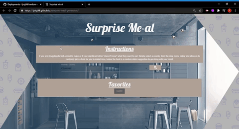
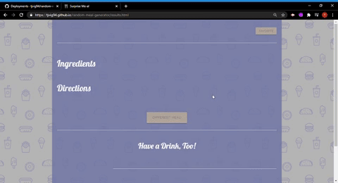

# Random Meal Generator

## Table of Contents 

* [Description](#description)
* [UserStory](#UserStory)
* [Usage](#usage)
* [Wireframe](#Wireframe)
* [Built With](#built-with)
* [Screenshot](#screenshot)
* [Live](#Live)

## Description
A user inputs a desired country/region and is given a random meal from that region. Or, the user may choose to receive a random meal from anywhere in the world. WOW!

A user is given ingredients and directions for the meal, along with an image of the meal and a map of where it is from. The user may choose to remember the meal as a "favorite" which will be displayed on the home screen.

A user may also choose to be given a random cocktail to go along with their meal.

## UserStory

As a foodie, I want a meal recommendation from a particular region so that I can prepare it for myself to eat!

## Usage
When arriving to main page select a country from which you would like to recieve a recipe from. Next, click on the search button.

You will then be directed to the results page where you will find your recipe as well as a random drink to accompany your meal. You have the option of saving the meal as well.

## Wireframe

[balsamiq](https://balsamiq.cloud/s522bel/pa3ocwe)

## Built With

* [HTML](https://html.spec.whatwg.org/) - Markup language used to define the structure of webpage.
* [jQuery](https://jquery.com/) - JavaScript library that simplifies HTML client-side scripting. Used in this application to access APIs and dynamically create and update HTML elements.
* [thecocktaildb](https://www.thecocktaildb.com/api.php/)
  Drinks from everywhere
  
* [themealdb](https://www.themealdb.com/api.php/)

## Live 
[Surprise Me-al](https://tjvig94.github.io/random-meal-generator/)
